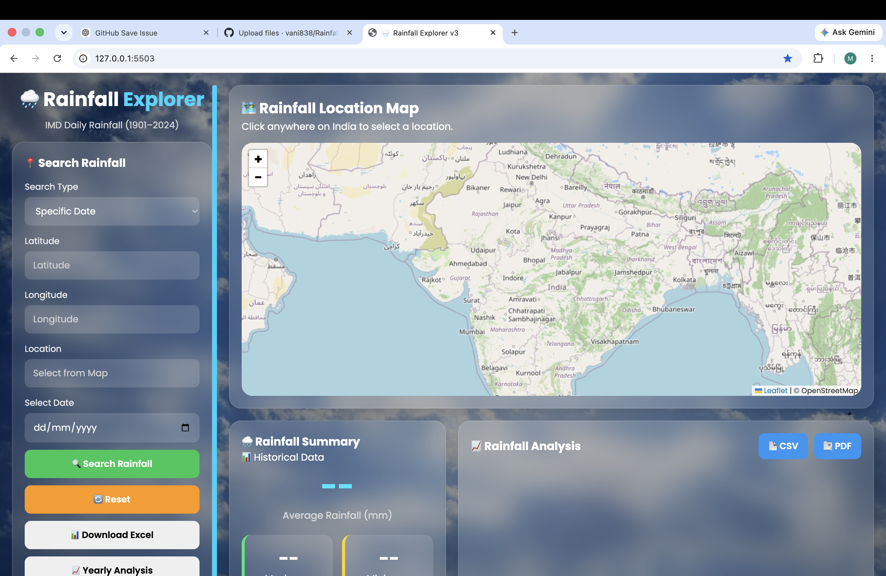

# 🌧️ Rainfall Explorer

A web-based rainfall analysis and visualization platform that allows users to explore rainfall data using **latitude, longitude, and date**.

The application combines historical rainfall data from **NetCDF datasets** with live rainfall data to provide an interactive and user-friendly rainfall exploration experience.
## 🖥️ Project Preview



## 🚀 Features

* 🌍 Interactive rainfall map using Leaflet
* 📍 Search rainfall data using latitude and longitude
* 📅 Select a specific date for rainfall analysis
* 🌧️ Display rainfall amount and rainfall category
* 📊 Visualize rainfall data through charts
* 📈 Analyze historical rainfall data
* 📄 Generate detailed Excel rainfall reports
* 🔄 Support for live rainfall data for dates beyond the historical dataset
* 🗺️ Location identification using map-based interaction
* 💻 Responsive web-based interface

## 🛠️ Technologies Used

### Backend

* Python
* Flask
* Xarray
* Pandas
* NumPy

### Frontend

* HTML
* CSS
* JavaScript
* Leaflet.js
* Chart.js

### Data & APIs

* NetCDF rainfall datasets
* Open-Meteo API
* OpenStreetMap

### Reporting

* OpenPyXL
* Excel report generation

## 🔄 How It Works

```text
User Input
    ↓
Latitude + Longitude + Date
    ↓
Rainfall Data Processing
    ↓
Historical NetCDF Dataset
        OR
Live Rainfall API
    ↓
Rainfall Analysis
    ↓
Interactive Result
    ↓
Map + Charts + Excel Report
```

## 📊 Data Processing

Historical rainfall data is processed using **Xarray**, which makes it possible to efficiently work with large multidimensional NetCDF datasets.

For locations within the historical dataset period, the application finds the nearest available geographical grid point and retrieves the corresponding rainfall data.

For dates beyond the historical dataset period, the application can retrieve rainfall information from a live weather data API.

## 📑 Excel Reports

The application can generate structured rainfall reports containing information such as:

* Summary
* Monthly rainfall analysis
* Yearly rainfall data
* Daily rainfall data
* Average rainfall
* Maximum and minimum rainfall
* Wet days
* Total rainfall

## 🖥️ Running the Project Locally

### 1. Clone the repository

```bash
git clone https://github.com/vani838/Rainfall-Explorer.git
cd Rainfall-Explorer
```

### 2. Create a virtual environment

```bash
python -m venv venv
```

Activate it on macOS/Linux:

```bash
source venv/bin/activate
```

### 3. Install dependencies

```bash
pip install -r requirements.txt
```

### 4. Run the Flask application

```bash
python app.py
```

### 5. Open the application

Open the local address shown in the terminal, for example:

```text
http://127.0.0.1:8000
```

## 📁 Project Structure

```text
Rainfall-Explorer/
│
├── app.py
├── requirements.txt
├── .gitignore
│
├── templates/
│   └── index.html
│
├── static/
│   ├── css/
│   ├── js/
│   └── ...
│
└── README.md
```

## 🎯 Project Objective

The objective of Rainfall Explorer is to make rainfall data easier to access, analyze, and visualize through an interactive web application.

Instead of working directly with large and complex rainfall datasets, users can enter a location and date and receive meaningful rainfall information through a simple interface.

## 🔮 Future Improvements

* User authentication
* Advanced rainfall forecasting
* More weather parameters
* Regional rainfall comparison
* Improved data caching
* Cloud deployment
* Advanced statistical analysis
* Automated rainfall alerts

## 👩‍💻 Author

**Vani Kumari**

B.Tech Computer Science Engineering

## ⭐ Project

If you find this project useful, consider giving the repository a star.
